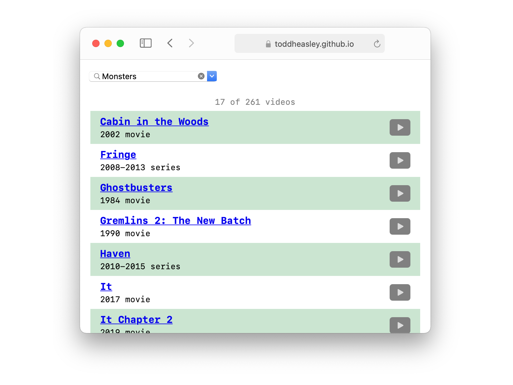

# Couchnado

Couchnado combines two pandemic projects, learning [SwiftUI](https://developer.apple.com/xcode/swiftui) and watching all visual media ever published, into one searchable database of my favorite movies and TV shows, for Apple TV, Mac, iPad, iPhone and iPod touch.

## Apple TV

Symmetrical, two-column interface for quickly filtering and finding something to watch, with direct links to content available in the [Apple TV app.](https://www.apple.com/apple-tv-app)

## iPad, iPhone and iPod

Adaptive design tucks filter functions away in compact situations.

## Mac (Catalyst)

[Catalyst](https://developer.apple.com/mac-catalyst) is still pretty bobo, but, then, so is Couchnado. And there's so much less code.

## Web

Find something to watch from any web browser.

## Powered by Spreadsheet

Couchnado's powerful data store is a single, static [tab-separated values (.tsv)](https://en.wikipedia.org/wiki/Tab-separated_values) file that can be edited in [Numbers](https://www.apple.com/numbers) or [Excel.](https://www.microsoft.com/en-ww/microsoft-365/excel) The complete database can be exported as a spreadsheet or web page from the Mac version of Couchnado.

## Requirements

Targets [iOS](https://developer.apple.com/ios)/[iPadOS](https://developer.apple.com/ipad)/[tvOS ](https://developer.apple.com/tvos) 14 and [macOS](https://developer.apple.com/macos) 11 Big Sur. Written in [Swift](https://developer.apple.com/documentation/swift) 5.3 and requires [Xcode](https://developer.apple.com/xcode) 12.2 or newer to build.

## Acknowledgments

Couchnado cribbed elements of its user interface from a few fantastic examples:

* [Building a Multi-platform App with SwiftUI](https://heartbeat.fritz.ai/building-a-multi-platform-app-with-swiftui-5336bce94689) by [Rick Wierenga](https://gist.github.com/rickwierenga)
* [How to create a slide-over card using SwiftUI (like in Maps or Stocks)](https://www.mozzafiller.com/posts/swiftui-slide-over-card-like-maps-stocks) by [Michael Shafer](https://github.com/mshafer)
* [SwiftUI ScrollView offset](https://fivestars.blog/swiftui/scrollview-offset.html) by [Federico Zanetello](https://github.com/zntfdr)

(Federico Zanetello's [Five Stars](https://fivestars.blog) blog is absolutely littered with useful SwiftUI exploration.)
