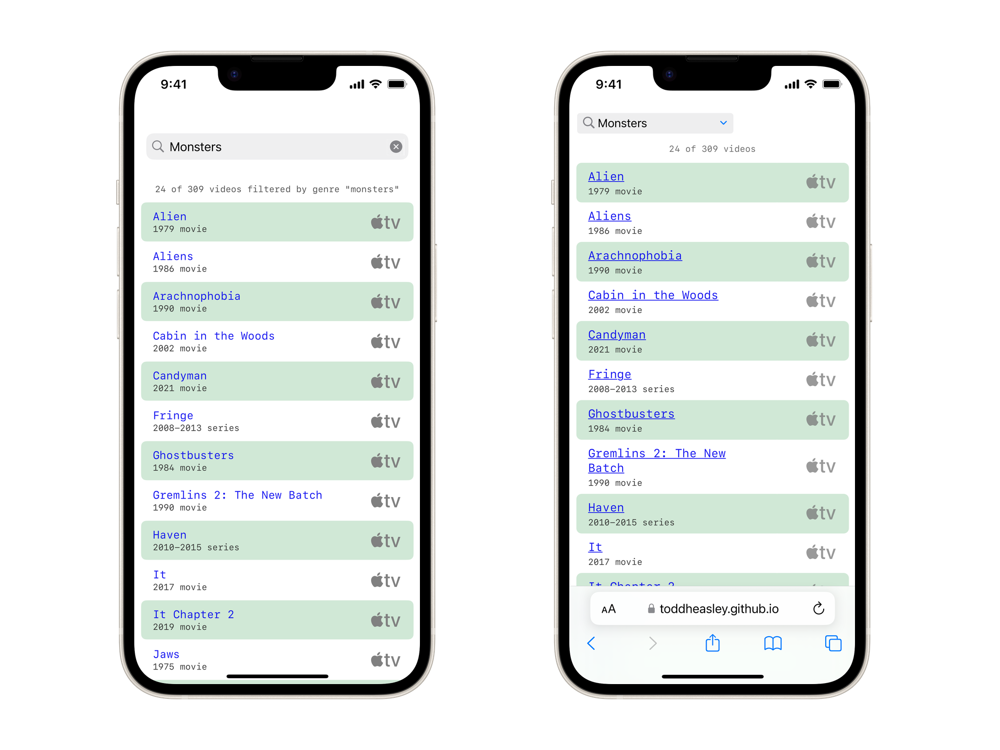

# Couchnado

Couchnado keeps my favorite movies and TV shows handy on Apple TV.

### Powered by Spreadsheet

Couchnado's thin veneer of [SwiftUI](https://developer.apple.com/xcode/swiftui) is driven by a single spreadsheet, brought to life by the included [`CouchData`](couchdata/) package.

### Requirements

Version 3 starts over with a unified SwiftUI app targeting [tvOS](https://developer.apple.com/tvos) 17, [iOS](https://developer.apple.com/ios)/[iPadOS](https://developer.apple.com/ipad) 17 and [macOS](https://developer.apple.com/macos) 14 Sonoma, including preliminary support for [visionOS.](https://developer.apple.com/visionos)

Written in [Swift](https://developer.apple.com/documentation/swift) 5.9. Builds in [Xcode](https://developer.apple.com/xcode) 15 or newer.
