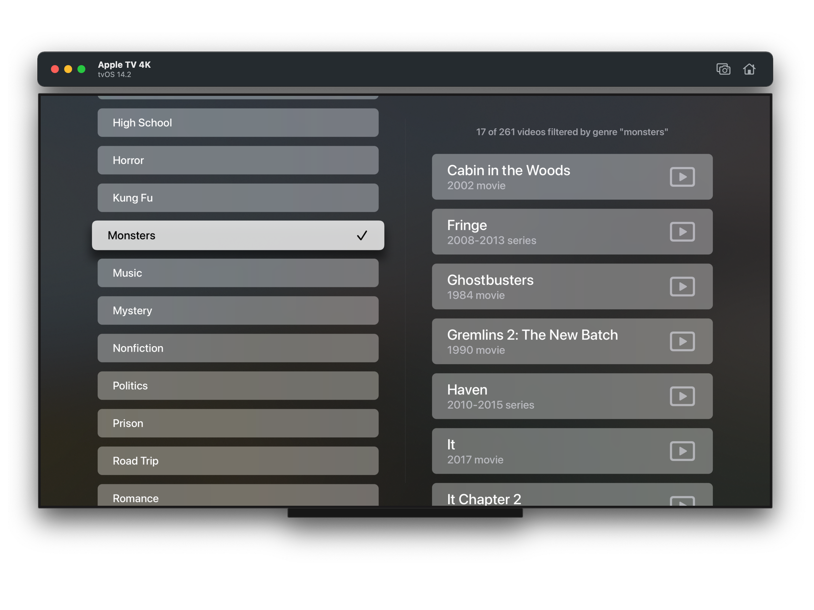
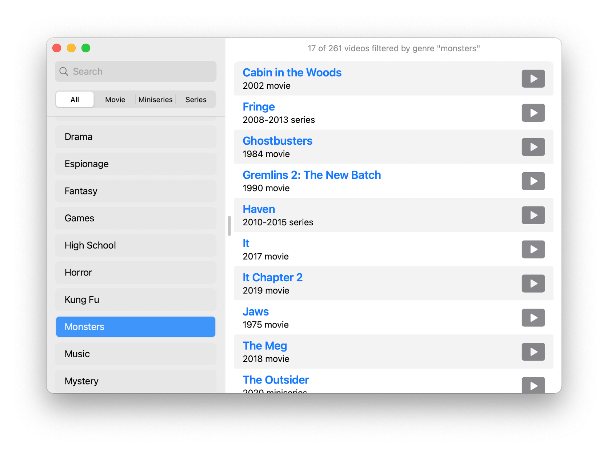
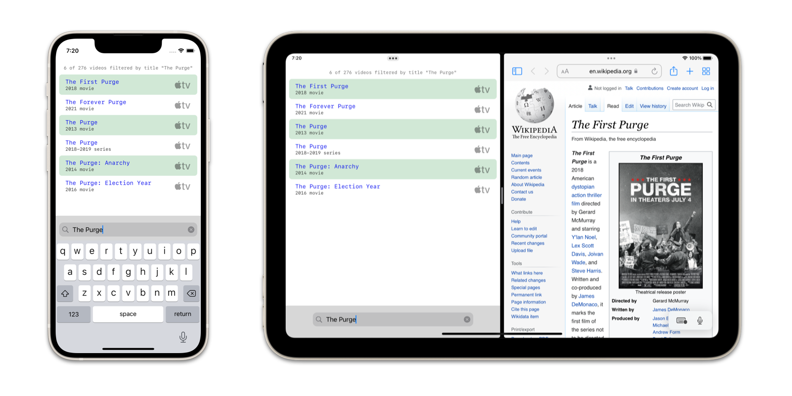

# Couchnado

Couchnado keeps my favorite movies and TV shows handy on Apple TV, with a simple, irritation-free interface.

Version 2 ditches Catalyst for Cocoa on the Mac. And, of course, the iPhone and iPad get all new UI as well.

## Powered by Spreadsheet

Couchnado's thin veneer of [SwiftUI](https://developer.apple.com/xcode/swiftui) is driven by a single spreadsheet, brought to life by the included [`CouchData`](couchdata/) package.

## Requirements

Targets [iOS](https://developer.apple.com/ios)/[iPadOS](https://developer.apple.com/ipad)/[tvOS ](https://developer.apple.com/tvos) 15 and [macOS](https://developer.apple.com/macos) 12 Monterey. Written in [Swift](https://developer.apple.com/documentation/swift) 5.5 and builds in [Xcode](https://developer.apple.com/xcode) 13 or newer.
