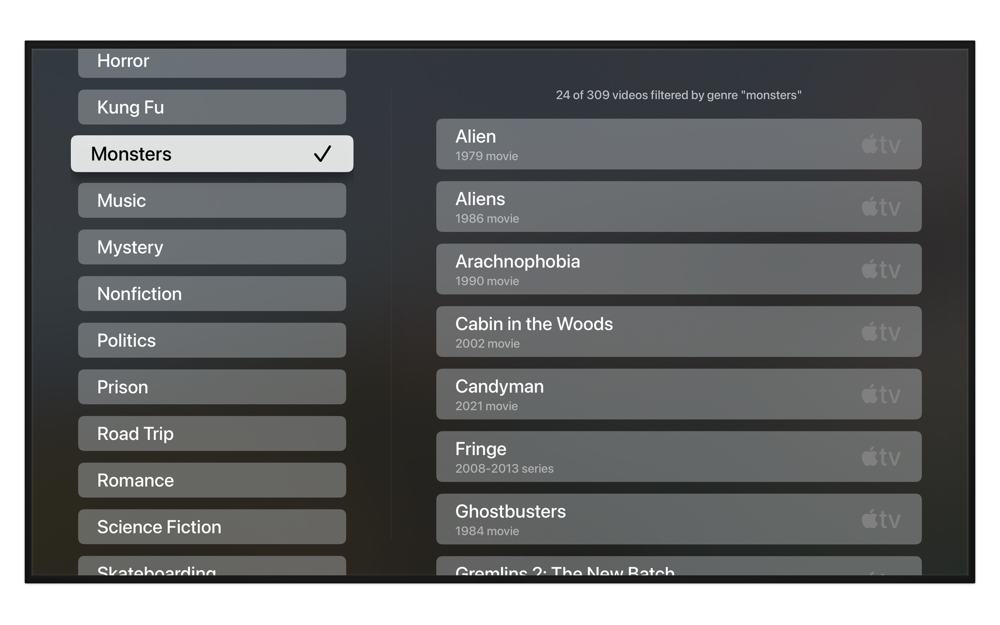
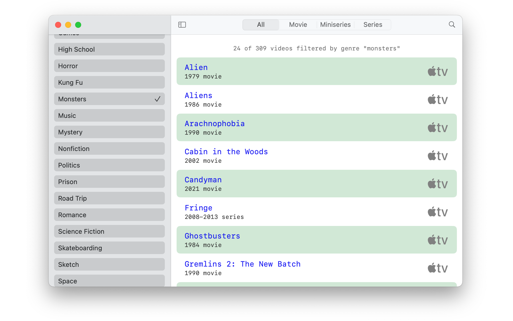

# Couchnado

Couchnado keeps my favorite movies and TV shows handy on Apple TV. Version 3 starts over with a cross-platform [SwiftUI](https://developer.apple.com/xcode/swiftui) target that adds preliminary support for [visionOS.](https://developer.apple.com/visionos)

### Powered by Spreadsheet

Couchnado's thin veneer of SwiftUI is driven by a single spreadsheet, brought to life by the included [`CouchData`](couchdata/) package.

|  | Written in [Swift](https://developer.apple.com/documentation/swift) 5.9 for [tvOS ](https://developer.apple.com/tvos) 17,[iOS](https://developer.apple.com/ios) 17 and [macOS](https://developer.apple.com/macos) 14 Sonoma. Builds in [Xcode](https://developer.apple.com/xcode) 15 or newer. |
