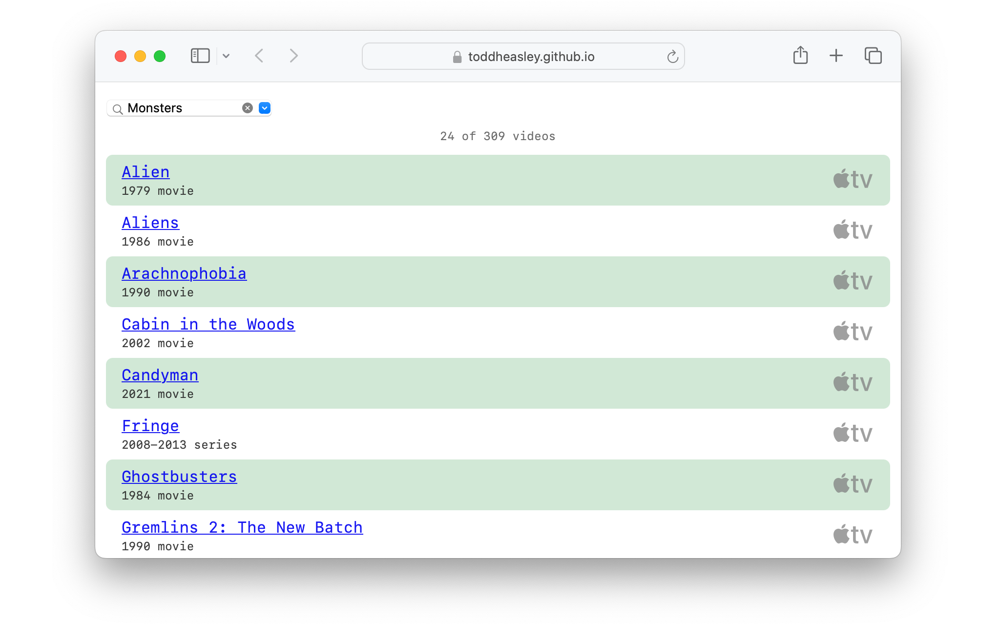

# `CouchData`

`CouchData` transforms rows and columns from a single, static [tab-separated values (.tsv) spreadsheet](https://en.wikipedia.org/wiki/Tab-separated_values) into video titles, links and genres. It also handles:

* Loading a canonical spreadsheet from the web
* Filtering and sorting videos by title, genre and format
* Importing and exporting local spreadsheets

The [canonical list of movies and TV shows](https://toddheasley.github.io/couchnado/index.tsv) that `CouchData` loads by default is a shared [Numbers](https://www.apple.com/numbers) doc where me and [@brennaheaps](https://github.com/brennaheaps) log our favorites.

## `HyperCouch`

`HyperCouch` extends the `CouchData` API to include:

* Sharing a common palette of fonts, colors and graphics between SwiftUI and CSS
* Exporting spreadsheets [for the web](https://toddheasley.github.io/couchnado)

### Requirements

Targets [iOS](https://developer.apple.com/ios) 18 and aligned releases, including [visionOS.](https://developer.apple.com/visionos) Written in [Swift](https://developer.apple.com/documentation/swift) 6. Builds in [Xcode](https://developer.apple.com/xcode) 16 or newer.
