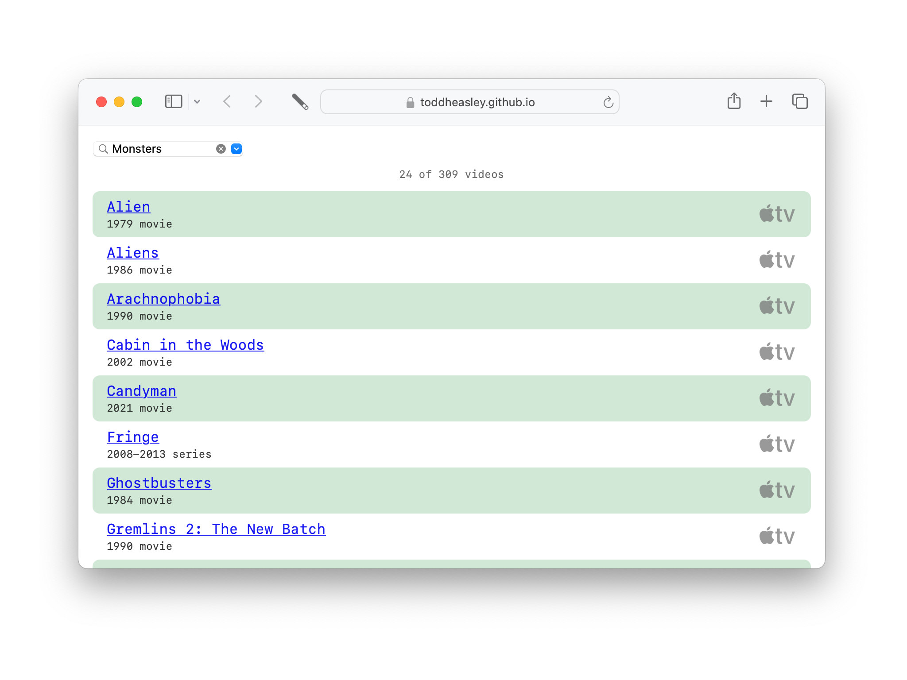

# `CouchData`

Couchnado's powerful data store is a static [tab-separated values (.tsv)](https://en.wikipedia.org/wiki/Tab-separated_values) file that can be edited in [Numbers](https://www.apple.com/numbers) or [Excel.](https://www.microsoft.com/en-ww/microsoft-365/excel) Literally, a spreadsheet of favorite movies and TV shows that [@brennaheaps](https://github.com/brennaheaps) and I started during COVID-19 quarantine.

`CouchData` transforms spreadsheet rows and columns into video titles, links and genres. It also provides an API for:

* Loading a canonical spreadsheet from the web
* Filtering and sorting videos by title, genre and format
* Importing and exporting local spreadsheets

## `HyperCouch`

`HyperCouch` extends the `CouchData` API to include:

* Sharing a common palette of fonts, colors and graphics between SwiftUI and CSS
* Exporting spreadsheets as [single-page web app](https://toddheasley.github.io/couchnado)

## Requirements

Targets [iOS](https://developer.apple.com/ios)/[iPadOS](https://developer.apple.com/ipad)/[tvOS ](https://developer.apple.com/tvos) 15 and [macOS](https://developer.apple.com/macos) 12 Monterey. Written in [Swift](https://developer.apple.com/documentation/swift) 5.5 and builds in [Xcode](https://developer.apple.com/xcode) 13 or newer.
